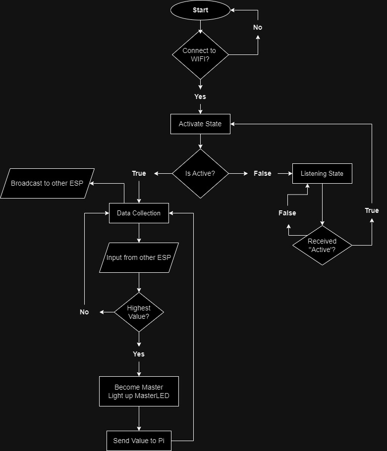

# IoT Light Swarm System Documentation

---

## 1. System Overview


### 1.1 Components Used
- 1× Raspberry Pi (Controller)
- 3× ESP8266 (Sensor Nodes)
- 4× LEDs + Resistors (Pi Display)
- 2× Onboard LEDs per ESP8266
- 1× Push Button (Reset Control)
- 3× Photoresistors (Light Sensing)

## 2. Hardware Configuration

### 2.1 Raspberry Pi Pinout


```
LED Connections:
┌─────────────┬──────────────┬─────────┐
│ Component   │ GPIO Pin     │ State   │
├─────────────┼──────────────┼─────────┤
│ Red LED     │ GPIO27 (330Ω)│ Active H│
│ Green LED   │ GPIO23 (330Ω)│ Active H│
│ Yellow LED  │ GPIO22 (330Ω)│ Active H│
│ White LED   │ GPIO24 (330Ω)│ Active H│
│ Reset Button│ GPIO15       │ Pull-DN │
└─────────────┴──────────────┴─────────┘
```

### 2.2 ESP8266 Setup


```
Sensor Circuit:
┌─────────────┬──────────────┬─────────┐
│ Component   │ Pin          │ Notes   │
├─────────────┼──────────────┼─────────┤
│ Light Sensor│ A0           │ Analog  │
│ Status LED  │ GPIO2        │ Active L│
│ Master LED  │ GPIO16 (330Ω)│ Active H│
└─────────────┴──────────────┴─────────┘
```

## 3. Communication Protocol

### 3.1 Network Configuration
```
Network Settings:
┌────────────┬───────────────┐
│ Parameter  │ Value         │
├────────────┼───────────────┤
│ UDP Port   │ 2910          │
│ Pi IP      │ 192.168.1.81  │
│ Broadcast  │ 192.168.1.255 │
│ ESP IPs    │ DHCP Assigned │
└────────────┴───────────────┘
```

### 3.2 Message Types
```
1. ESP Broadcast (200ms interval)
   LIGHT:[deviceID]:[reading]
   Example: "LIGHT:1234:567"

2. Master Report (1s interval)
   MASTER:[deviceID]:[reading]
   Example: "MASTER:1234:567"

3. Control Commands
   Reset: "RESET"
   Activate: "ACTIVATE"
```

## 4.Part 1 - Raspberry Pi WiFi setup and packet delivery

### 4.1 System Flowchart


### 4.2 State Descriptions
```
┌──────────────┬────────────────────────────┐
│ State        │ Description                │
├──────────────┼────────────────────────────┤
│ Initial      │ GPIO/Network setup         │
│ Listening    │ Monitor UDP packets        │
│ LED Control  │ Update visual feedback     │
│ Reset        │ System pause & clear       │
│ Active       │ Normal operation           │
└──────────────┴────────────────────────────┘
```

### 4.3 Main Functionality


### State Descriptions

1. **Initial State**
   - Sets up GPIO pins (LED outputs, button input), initializes UDP socket on port 2910.
   - Creates empty device tracking and LED assignment arrays.

2. **Listening State**
   - Continuously monitors for UDP messages starting with "MASTER:".
   - Filters and processes only master device messages for LED control.

3. **LED Control State**
   - Controls LED behaviors based on master ESP data (assigns colors, manages flash rates).

4. **Reset State**
   - Clears all device data, turns on WHITE LED for 3 seconds, sends RESET command.
5. **Active State**
   - Normal operation where system processes messages and updates LED displays.

### 4.4 Describe Pi code

#### Input Functions
```python
def receive_data(self):
    # Receives UDP packets from ESPs
    data, addr = self.sock.recvfrom(1024)
    message = data.decode('utf-8')
    if message.startswith('MASTER:'):
        self.handle_message(message, addr)
```

Explanation:

- Continuously listens for UDP packets on port 2910
- Filters for MASTER messages only (format: "MASTER:deviceID:reading")
- Runs in separate thread for non-blocking operation
- Forwards valid messages for processing
```python
def handle_button(self):
    # Monitors reset button state
    if GPIO.input(RESET_BUTTON) == GPIO.HIGH:
        self.send_reset() if self.system_active else self.send_activate()
```


 Explanation:
- Monitors GPIO15 for button press events
- debounce protection (500ms)
- Toggles between reset and activate states
#### Processing Functions
```python
def handle_message(self, message, addr):
    # Processes master messages and updates device tracking
    _, device_id, reading = message.split(':')
    # Update device data and LED assignments
    device_data[device_id] = {
        'reading': int(reading),
        'last_seen': time.time()
    }
```
Explanation:

- Parses incoming MASTER messages
- Maintains device tracking dictionary
- Records timestamp for timeout detection
- Manages LED assignments for new devices

```python
def calculate_flash_delay(self, reading):
    # Maps reading to LED flash delay
    return max(0.1, 1.0 - (reading / 1023.0 * 0.9))
```
Explanation:

- Converts sensor reading (0-1023) to flash delay
- Higher reading = faster flash rate (0.1s - 1.0s)
- Creates visual representation of light intensity
#### Output Functions
```python
def update_leds(self):
    # Controls LED states for visual feedback
    if self.current_master:
        led_pin = device_led_assignments[self.current_master]
        GPIO.output(led_pin, GPIO.HIGH)
        time.sleep(self.calculate_flash_delay(reading))
        GPIO.output(led_pin, GPIO.LOW)
```
Explanation:

- Each ESP gets assigned specific LED color
- Flash rate indicates light sensor reading
- Only master's second LED is active at any time
```python
def send_reset(self):
    # Handles system reset
    for led in [RED_LED, GREEN_LED, YELLOW_LED]:
        GPIO.output(led, GPIO.LOW)
    GPIO.output(WHITE_LED, GPIO.HIGH)
    self.sock.sendto(b'RESET', (BROADCAST_IP, UDP_PORT))
```
Explanation:

- Clears all device assignments
- Turns off all RGB LEDs
- Flashes WHITE LED for 3 seconds
- Broadcasts RESET command to all ESPs


## 5. Part 2 - ESP WiFi setup and packet delivery


### 5.1 System Flow Chart



### 5.2 State Descriptions

1. **Initial State**
   - Configures GPIO (LED outputs, analog input), connects to WiFi.
   - Generates unique device ID (1000-9999) for identification.
   - Sets up UDP communication on port 2910.

2. **Data Collection**
   - Reads analog light sensor value (0-1023).
   - Broadcasts readings every 200ms to other ESPs.
   - Updates status LED based on reading intensity.

3. **Master Election**
   - Compares local reading with others in swarm.
   - Highest reading becomes master with dedicated LED indicator.
   - Device with highest reading sends data to Raspberry Pi.

### 5.3 Main Functionality with Code Explanation

#### Input Functions
```cpp
// 1. Light Sensor Reading
void loop() {
    currentReading = analogRead(LIGHT_SENSOR_PIN);
    // Analog reading (0-1023) from photoresistor
}

// 2. Network Input
void handleIncomingPackets() {
    int packetSize = udp.parsePacket();
    if (packetSize) {
        // Read packet into buffer
        udp.read(packetBuffer, PACKET_SIZE);
        lastReceivedTime = millis();
        
        if (strncmp(packetBuffer, "LIGHT:", 6) == 0) {
            // Process light readings from other ESPs
            int remoteID, remoteReading;
            sscanf(packetBuffer, "LIGHT:%d:%d", 
                   &remoteID, &remoteReading);
        }
    }
}
```
Explanation:
- `analogRead()` converts photoresistor voltage to digital value
- `handleIncomingPackets()` processes UDP messages from other ESPs and Pi
- Packet format validation prevents processing invalid data

#### Processing Functions
```cpp
// 1. Master Election
void updateMasterStatus() {
    bool shouldBeMaster = true;
    int highestReading = currentReading;
    
    // Compare with other devices
    for (int i = 0; i < numDevices; i++) {
        if (swarmReadings[i].reading > highestReading) {
            shouldBeMaster = false;
            highestReading = swarmReadings[i].reading;
        }
    }
    
    // Update master status
    if (shouldBeMaster != isMaster) {
        isMaster = shouldBeMaster;
        digitalWrite(MASTER_LED, isMaster ? LOW : HIGH);
    }
}

// 2. LED Control
void handleStatusLED() {
    // Calculate flash rate based on reading
    int flashDelay = map(currentReading, 0, 1023, 1000, 100);
    
    if (millis() - lastToggle >= flashDelay) {
        digitalWrite(STATUS_LED, !digitalRead(STATUS_LED));
        lastToggle = millis();
    }
}
```
Explanation:
- `updateMasterStatus()` determines if this ESP has highest reading
- `handleStatusLED()` creates visual feedback proportional to reading
- LED flash rate increases with higher light readings

#### Output Functions
```cpp
// 1. Broadcast to Other ESPs
void broadcastReading() {
    char message[32];
    snprintf(message, sizeof(message), "LIGHT:%d:%d", 
             deviceID, currentReading);
    
    // Send to all ESPs
    udp.beginPacketMulticast(broadcastIP, BROADCAST_PORT, 
                            WiFi.localIP());
    udp.write(message);
    udp.endPacket();
}

// 2. Report to Raspberry Pi
void sendToRaspberryPi() {
    if (!isMaster) return;
    
    char message[32];
    snprintf(message, sizeof(message), "MASTER:%d:%d", 
             deviceID, currentReading);
    
    // Send to Pi
    udp.beginPacket(raspberryPi, BROADCAST_PORT);
    udp.write(message);
    udp.endPacket();
}
```
Explanation:
- `broadcastReading()` shares readings with other ESPs every 200ms
- `sendToRaspberryPi()` sends master data to Pi every second
- Different message formats for ESP-to-ESP and ESP-to-Pi communication

### Global Variables and Configuration
```cpp
// Network settings
const int BROADCAST_PORT = 2910;
const unsigned long BROADCAST_INTERVAL = 200;  // 200ms
const unsigned long MASTER_TIMEOUT = 2000;     // 2s

// State tracking
bool isActive = true;           // System active flag
bool isMaster = false;          // Master status
int deviceID;                   // Random device identifier
int currentReading;             // Current sensor value
int numDevices = 0;             // Active devices in swarm
```
Explanation:
- Network parameters define communication timing
- State variables track device status and readings
- Timeouts ensure system resilience

